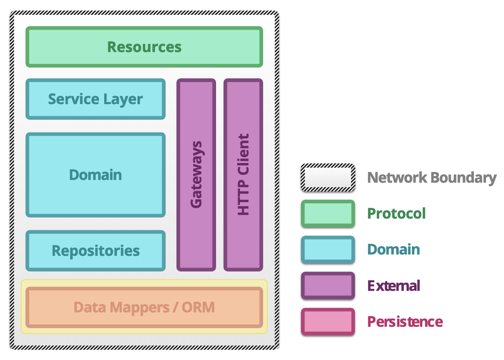

# microprofile-archetype
A microservice archetype project based on Eclipse MicroProfile, run on OpenLiberty and tested on Arquillian

The project is dividied into 4 different components:
1. **Resource Component:** 
    - Responsible for exposing the service
2. **Domain Component:**
    - Contains service, domain and repositories which define the application business domain
3. **Gateway Component:**
    - Gateway to other services, e.g. REST Clients, MDB's etc.
4. **Persistence Component:**
    - ORM Layer, used for data storage
    

